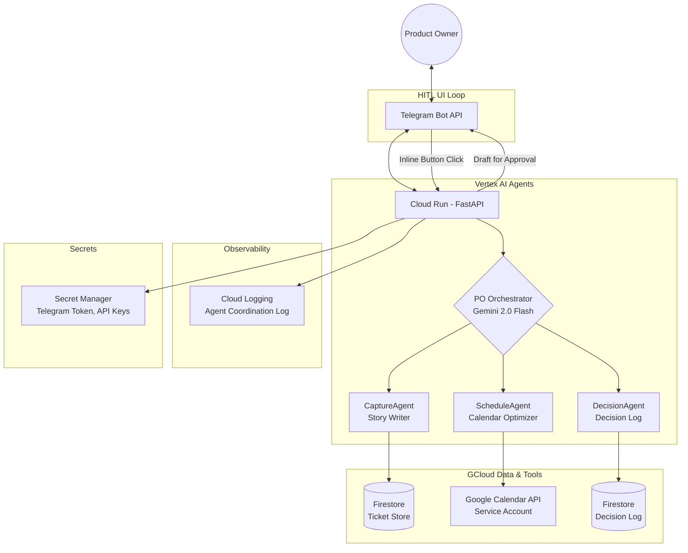

# Vantage: Telegram-First Execution Assistant

A mobile-first AI assistant for **Software Product Owners** that converts raw inputs into Jira updates, calendar actions, and decision logs via **Telegram** — deployed on **Google Cloud**.

## Core Concept: "Message to Action"
The assistant operates as an **Execution Layer**, not a generic chatbot. Every interaction follows:
1. **Capture**: Receive raw text from Telegram.
2. **Retrieve**: Pull context from the Ticket Store (Firestore), GCal (availability), and Decision Logs (Firestore).
3. **Classify & Route**: The PO Orchestrator (Gemini 2.0 Flash via Vertex AI) determines which sub-agent handles the request.
4. **Draft**: The routed sub-agent proposes structured items (Stories, Bugs, Calendar blocks, Decision entries).
5. **Approve (HITL)**: User confirms via Telegram inline buttons (e.g., [✅ Create], [✏️ Edit], [❌ Cancel]).
6. **Execute**: Updates Firestore Ticket Store / Calendar and stores the workflow log in Cloud Logging.

## Authentication & Multi-Tenancy
To ensure data privacy without complex OAuth:
- **Telegram ID as Key**: All Firestore records (`tickets`, `decisions`, `user_state`) will be keyed or filtered by the user's unique Telegram ID.
- **First-Time Flow**: Upon the first `/start` or message, the system checks if the user exists. If not:
    1. Create a user profile.
    2. Seed the database with sample data (e.g., SSO decision, roadmap focus blocks).
    3. Send a curated welcome message.

> **Scope note**: Real Jira Cloud MCP integration is deferred post-hackathon due to OAuth setup risk. The Ticket Store is a Firestore collection mirroring Jira's schema (`ticket_id`, `title`, `priority`, `epic`, `status`, `acceptance_criteria`). This is honest engineering — the agent logic, orchestration, and approval loop are fully demonstrable without live Jira auth.

---

## Critical Human-In-Loop (HITL) Points
The assistant **never** modifies external state without direct confirmation in the Telegram chat:

- **Ticket Drafting**: When a stakeholder ask is captured, the bot presents a summary (Title, Priority, Epic, Acceptance Criteria) with a [✅ Create Ticket] button.
- **Calendar Suggestions**: The bot suggests two specific conflict-free slots. The PO must tap a slot to confirm.
- **Decision Validation**: After a decision is logged, the bot asks: "Is this accurate? [✅ Confirm] [✏️ Edit]" — preventing hallucinations from becoming official records.
- **Bulk Note Processing**: After parsing meeting notes, the bot lists identified items individually. The PO can toggle items on/off before they are pushed to the Ticket Store.
- **Clarification Pattern (NEW)**: When the Orchestrator confidence score is below threshold, the bot asks one targeted follow-up question before routing — e.g., "Is this a new feature request or a bug fix?" This demonstrates genuine multi-turn agent reasoning.

---

## Key Interaction Patterns

### 1. Capture & Classify (Stakeholder Asks)
- **Pattern**: "Stakeholder wants [X], seems [Urgency]."
- **Action**: Orchestrator routes to CaptureAgent → extracts request → classifies type → drafts Firestore ticket with Acceptance Criteria → links to Epic.
- **Goal**: Never forget a hallway conversation or meeting ask.

### 2. Note-to-Backlog Engine
- **Pattern**: Paste rough meeting minutes.
- **Action**: CaptureAgent extracts Actions vs. Decisions vs. Open Questions → drafts ticket entries → PO toggles items before commit.
- **Result**: Structured tickets in Firestore; blockers/dependencies flagged.

### 3. Focus Protection (GCal Optimization)
- **Pattern**: "Find 2 focus blocks for roadmap work."
- **Action**: ScheduleAgent scans GCal → identifies conflict-free 90-min windows → proposes two blocks via inline buttons.
- **Note**: Prioritises deep work before major ceremonies (Sprint Planning). GCal uses a service account against a single owned test calendar (no OAuth consent screen issue during demo).

### 4. Smart Prioritisation
- **Pattern**: "Should I prioritise [A], [B], or [C] first?"
- **Action**: CaptureAgent pulls Firestore ticket data → Gemini scores on Impact/Urgency/Effort → returns ranked order with rationale.

### 5. Decision Continuity Log
- **Pattern**: "Decision: we are deferring SSO to next quarter."
- **Action**: DecisionAgent logs decision with timestamp and linked Epic to Firestore `decisions` collection.
- **Query**: "What did we decide about SSO?" retrieves the log via Firestore structured query.
- **Demo moment**: Log a decision, then query it back 2 minutes later via Telegram — the killer demo closer.

---

## Agent Design & Prompt Strategy

Each agent has a focused system prompt. The Orchestrator decides routing based on message content — it does not use if/else logic.

### PO Orchestrator
- **Role**: Classify incoming message and route to exactly one sub-agent.
- **System prompt core**: Given the Product Owner's message, classify intent as one of: `[CAPTURE, SCHEDULE, DECISION, PRIORITISE, CLARIFY]`. Return a JSON object with `{ "agent": "<name>", "confidence": 0.0-1.0, "extracted_context": {} }`. If confidence < 0.75, return `"agent": "CLARIFY"` with a single follow-up question.

### CaptureAgent (story_writer)
- **Role**: Convert vague asks into structured Jira-schema tickets with Acceptance Criteria.
- **System prompt core**: You are a senior Product Owner. Given a raw stakeholder request, produce a JSON ticket with `title`, `type` (Story/Bug/Task), `priority`, `epic`, `acceptance_criteria` (3 bullet points minimum), and `dependencies`. Be specific. Never leave Acceptance Criteria vague.

### ScheduleAgent (calendar_optimizer)
- **Role**: Find and propose conflict-free deep work blocks.
- **System prompt core**: Given the user's existing calendar events, identify two 90-minute windows that avoid ceremony buffers (30 min before/after standups, planning, reviews). Prefer morning slots. Return exactly two options with start time and a one-line rationale.

### DecisionAgent (decision_log)
- **Role**: Store and retrieve structured decisions.
- **System prompt core**: Extract the decision statement, the implied rationale, and any linked Epic from the user's message. Store as `{ "decision", "rationale", "epic", "timestamp", "tags" }`. On retrieval queries, return the most relevant decision with its timestamp and rationale.

---

## Architecture

---

## Tech Stack

| Layer | Technology | Notes |
|---|---|---|
| Interface | Telegram Bot (`python-telegram-bot`) | Webhook URL = Cloud Run service URL |
| Backend | FastAPI on **Cloud Run** | Min instances = 1 (prevents cold start during demo) |
| LLM | **Gemini 2.0 Flash via Vertex AI** | Native GCloud auth via service account; no separate API key |
| Ticket Store | **Firestore** collection (`tickets`) | Mirrors Jira schema; real Jira MCP post-hackathon |
| Decision Store | **Firestore** collection (`decisions`) | Structured query for retrieval; path to Vector Search post-hackathon |
| Calendar | Google Calendar API (service account) | Avoids OAuth consent screen issues during demo |
| Secrets | **Secret Manager** | Telegram token, GCal service account key |
| Observability | **Cloud Logging** | Agent routing decisions logged; show during pitch |

---

## Backend Modules

- `telegram/bot.py` — Webhook handler, message parsing, inline button responses.
- `agents/orchestrator.py` — Gemini-powered routing with confidence scoring and clarification fallback.
- `agents/story_writer.py` — Converts vague asks into structured tickets with Acceptance Criteria.
- `agents/calendar_optimizer.py` — Finds and proposes conflict-free deep work slots.
- `agents/decision_log.py` — Stores and retrieves structured decisions from Firestore.
- `storage/firestore_client.py` — Shared Firestore read/write wrapper.

## Proposed Changes

### Core Backend

#### [NEW] [firestore_client.py](file:///c:/Python/Vantage/storage/firestore_client.py)
Shared client for interacting with Firestore. Will include methods for `get_user`, `create_user`, and scoped data access.

#### [NEW] [onboarding.py](file:///c:/Python/Vantage/logic/onboarding.py)
Logic for seeding sample data for new users.

#### [NEW] [orchestrator.py](file:///c:/Python/Vantage/agents/orchestrator.py)
Routing logic using Gemini 2.0 Flash.

#### [NEW] [story_writer.py](file:///c:/Python/Vantage/agents/story_writer.py)
Agent for drafting stories/bugs.

#### [NEW] [calendar_optimizer.py](file:///c:/Python/Vantage/agents/calendar_optimizer.py)
Agent for GCal scheduling.

#### [NEW] [decision_log.py](file:///c:/Python/Vantage/agents/decision_log.py)
Agent for logging decisions.

#### [NEW] [bot.py](file:///c:/Python/Vantage/telegram/bot.py)
Telegram bot entry point. Includes auth middleware to check user existence and trigger onboarding.

## Verification Plan

### Automated Tests
- Mock Telegram updates to test agent routing.
- Unit tests for Firestore wrappers.

### Manual Verification
- Deploy to Cloud Run (simulated or real).
- Send messages via Telegram and verify inline button responses.
